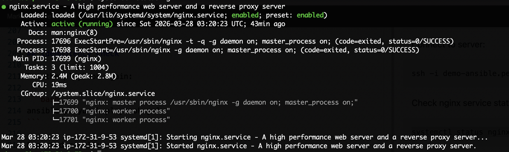
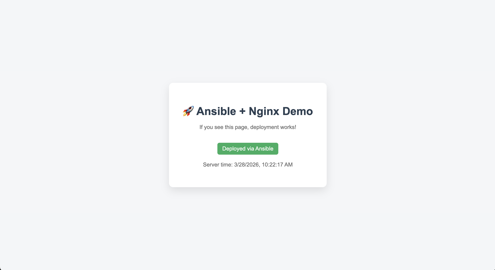

# Ansible EC2 Configuration - Practice Project

## Description

This project demonstrates how to configure a fresh Ubuntu EC2 instance using Ansible.

The playbook automates server setup tasks including:

- installing base packages
- installing and configuring Nginx
- deploying a static website
- creating a cron job
- applying idempotent configuration using handlers

The goal of this project is to practice Infrastructure as Code principles and automate server provisioning in a repeatable way.

---

## Prerequisites

Before getting started, ensure you have the following tools installed locally.

### Required Tools

#### 1. Ansible

Install Ansible by following the official documentation:

https://docs.ansible.com/projects/ansible/latest/installation_guide/intro_installation.html

Verify installation:

```bash
ansible --version
```

#### 2. AWS account

Used to create the EC2 instance.

#### 3. SSH client

Used to connect to the EC2 instance.

---

## EC2 Setup

Create a new EC2 instance using the following configuration:

| Setting | Value |
|--------|------|
| AMI | Ubuntu 22.04 LTS |
| Instance type | t2.micro |
| Storage | default |
| Key pair | create new key pair |

Download the key file:

demo-ansible.pem

Move the key file into the project directory.

---

## Security Group Configuration

Edit the EC2 Security Group inbound rules.

### Allow SSH access

| Type | Port | Source |
|------|------|--------|
| SSH | 22 | your IP |

### Allow HTTP access (for Nginx)

| Type | Port | Source |
|------|------|--------|
| HTTP | 80 | 0.0.0.0/0 |

Port 80 must be open so the Nginx web server can be accessed from browser.

---

## Test SSH Connection

Update key permission:

```bash
chmod 400 demo-ansible.pem
```

Connect to EC2:

```bash
ssh -i demo-ansible.pem ubuntu@<EC2_PUBLIC_IP>
```

If login succeeds, the server is ready.

---

## Update Inventory Host

Edit file:

inventory.yml

Update the public IP of your EC2 instance:

```yaml
all:
  hosts:
    myserver:
      ansible_host: <EC2_PUBLIC_IP> # {{ your_public_ip }}
```

## Run Playbook

Execute the playbook:

```bash
ansible-playbook playbook.yml
```

The playbook will automatically:

- update apt packages
- install nginx
- start nginx service
- deploy index.html to server
- create cron job
- restart nginx when configuration changes

---

## Verify Web Server

Connect to server:

```bash
ssh -i demo-ansible.pem ubuntu@<EC2_PUBLIC_IP>
```

Check nginx service status:

```bash
systemctl status nginx
```

Expected result:

Service is active and running.




---

Open browser:

```
http://<EC2_PUBLIC_IP>
```

Example:

```
http://3.25.123.10
```

Expected result:

Web page is displayed successfully.



---

## Verify Cron Job

Connect to server:

```bash
ssh -i demo-ansible.pem ubuntu@<EC2_PUBLIC_IP>
```

Check cron configuration:

```bash
crontab -l
```

Expected result:

```
*/5 * * * * echo hello >> /tmp/hello.log
```

Check cron output:

```bash
cat /tmp/hello.log
```

Example output after a few minutes:

```
hello
hello
hello
```

---

## Idempotency Check

Run the playbook again:

```bash
ansible-playbook playbook.yml
```

Expected result:

```
changed=0
```

This confirms the system is already in the desired state.

---

## What This Project Demonstrates

- YAML based Ansible inventory
- role based configuration structure
- handler usage for controlled service restart
- cron job automation
- reproducible server configuration
- Infrastructure as Code workflow

---

## Result

Using a single command, a fresh EC2 instance is configured into a running web server with a scheduled background job.